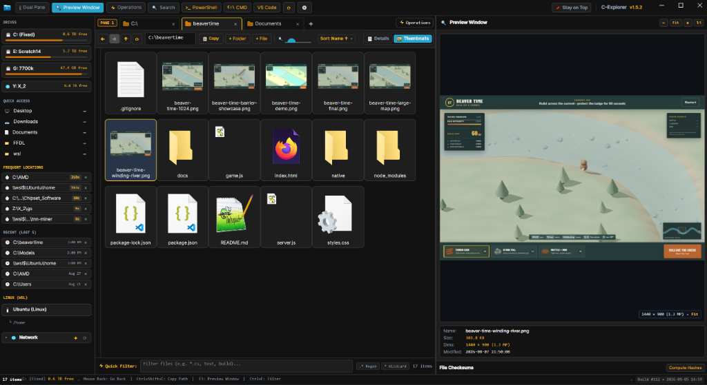

# ClankerExplorer (C-Explorer) ⚡

A high-performance, dark-mode, power-user file manager built with **C# (.NET 8)** and **Avalonia UI**, designed for speed, clarity, and deep power-user workflow integration.

Compiles directly to a **single standalone Windows executable (`.exe`)** with zero runtime dependencies, and can be built natively on **Linux (X11 / Wayland)**.

---

## 📸 Overview



---

## 🌟 Key Features

- 📑 **Tabs & Dual-Pane Navigation**: Multi-tab browsing with independent address bars and file grids; side-by-side Dual Pane split (`Ctrl+Shift+D`).
- 🖱️ **Hardware Mouse Navigation**: Native hardware thumb buttons (`XButton1` / `XButton2`) for instant Back and Forward history navigation.
- 🔀 **System-Wide Drag & Drop**: Full Windows OLE drag-and-drop — drag files out of ClankerExplorer into Explorer, Desktop, browsers, email clients, chat apps, editors, or any application that accepts file drops. Likewise, drop files from any external app into ClankerExplorer with automatic Copy/Move resolution based on drive and modifier keys.
- 🖼️ **Rich Thumbnails & Video Previews**: Native Windows shell thumbnail extraction for images, videos (MP4, MKV, AVI, MOV, WMV, etc.), PDFs, and other thumbnail-capable file types. Video files show actual frame previews — not generic icons.
- 🎨 **High-Resolution File Icons**: True 256×256 Jumbo shell icons via `SHGetImageList(SHIL_JUMBO)` for crystal-clear file type icons in Thumbnail/Grid view. No more blurry upscaled 32px icons — PDF, ZIP, EXE, folder, and all other file type icons render at native Windows quality.
- 📋 **Permanent Directory Path**: Always-visible path with a 1-click **"Copy Path"** button (`Ctrl+Shift+C`), plus full path copy on right-click.
- 👁️ **Zero File Hiding**: File extensions (`.exe`, `.tar.gz`, `.cs`, `.json`) are always displayed. Hidden and system files are clearly highlighted.
- 📊 **Configurable Data Columns**:
  - Right-click column header or menu to toggle visible columns on the fly:
  - `Name`, `Ext`, `Size`, `Date Modified`, `Date Created`, `Date Accessed`, `Type`, `Attributes (Windows)`, `Permissions (POSIX rwx)`, and `Owner:Group`.
- ✂️ **Visual Cut Feedback**: Cut items dim to semi-transparent (`45% opacity`) just like Windows Explorer until paste or overwrite.
- 🗑️ **Safe Deletion Modal**: Clean delete confirmation dialog with keyboard shortcuts (`Enter` to delete, `Esc` to cancel).
- 📦 **7-Zip Integration**: Dedicated, high-speed context menu actions with explicit **7-Zip** branding for extraction (`Extract Here`, `Extract to "<folder>\"`, `Extract To...`) and compression (`Add to "<name>.zip"`, `Add to archive...`).
- 📝 **Editor Integrations**: Auto-detects **Notepad++** and default text editors for 1-click editing of code, config, log, and markdown files.
- 🕒 **Persistent History & Frequent Locations**:
  - Automatically tracks frequent and recent folder visits (`%APPDATA%\C-Explorer\history.json`).
  - Middle-compact paths (e.g. `C:\...\Subfolder`).
  - Row-level `×` reset with instant `↩ Undo` restoration banner.
- 🌐 **Network & WSL Browser**: Collapsible bottom section for network shares, local subnets, and WSL Linux distributions.
- 🔍 **Multi-Format Quick Inspector (`F3`)**:
  - 🎬 **Video Playback**: Hardware-accelerated 60fps LibVLC video engine with timeline scrubbing, instant Play/Pause, and persistent audio volume/mute preferences.
  - 📄 **PDF Document Viewer**: Multi-page PDF renderer with page navigation (`Next`/`Prev`), zoom controls (`Ctrl+Wheel`), and fit-to-window mode.
  - 🗜️ **Archive Inspector**: Instant ZIP, RAR, and compressed archive file tree viewer showing file names, uncompressed sizes, and compression ratios without manual extraction.
  - 🖼️ **Image Viewer**: High-resolution image preview with fit/actual toggle, zoom slider, and mouse wheel controls.
  - 💻 **Code & Hex Viewer**: Syntax viewer, Binary Hex dump (Offset / Hex / ASCII), and instant SHA-256 & MD5 hash calculator.
- ⚡ **Live Quick Filter (`Ctrl+F`)**: Real-time wildcard (`*.cs`, `*test*`) and regular expression file search with 250ms catastrophic backtracking protection.
- 🧠 **Per-Folder View Memory**: Each folder remembers Details/Thumbnails mode, thumbnail size, sort and direction, visible columns, widths/order, and the previous scroll location across navigation and restarts.
- 💾 **Portability & Full Backup**:
  - Portable single-file profile export/import (`settings.json` + `history.json` + column layout).
  - Cross-platform path normalization between Windows (`C:\...`) and Linux (`/home/...`).

---

## ⌨️ Keyboard Shortcuts

| Shortcut | Action |
| :--- | :--- |
| `Ctrl + Shift + C` | **Copy Current Directory Path to Clipboard** |
| `Ctrl + T` | **New Tab** |
| `Ctrl + W` | **Close Active Tab** |
| `Ctrl + Shift + D` | **Toggle Dual-Pane Split View** |
| `F3` | **Toggle File Inspector (Code / Hex / Hashes)** |
| `Ctrl + F` | **Focus Quick Filter Bar (Wildcard & Regex)** |
| `Ctrl + Shift + T` | **Open PowerShell in Current Directory** |
| `Ctrl + Shift + N` | **Create New Folder** |
| `Ctrl + N` | **Create New File** |
| `Delete` | **Delete Selected Item (With Confirmation Modal)** |
| `Shift + Delete` | **Permanent Delete Bypass** |
| `F5` | **Refresh Directory & Drives** |
| `Mouse Back / Forward` | **Navigate Directory History** |

---

## 🛠️ Building & Publishing

### Debug Run
```bash
dotnet run
```

### Tests

Run the fast regression suite from the repository root:

```bash
dotnet test
```

The suite uses disposable filesystem and configuration directories. See [tests/README.md](tests/README.md) for its structure and current UI/integration boundaries.

### Large-folder performance probe

Measure enumeration, allocation, and natural-sort cost against an existing directory:

```bash
dotnet run --project tools/ClankerExplorer.PerformanceProbe -- <directory>
```

See [docs/large-folder-performance.md](docs/large-folder-performance.md) for the 1k/10k/50k baseline, thumbnail scheduling/cache architecture, virtualization proof, and remaining limits.

### Build Single-File Windows Executable (`.exe`)
```bash
dotnet publish -c Release -r win-x64 --self-contained -p:PublishSingleFile=true
```
The standalone `.exe` is generated at:
`bin/Release/net8.0/win-x64/publish/ClankerExplorer.exe`

### Build Linux Executable
```bash
dotnet publish -c Release -r linux-x64 --self-contained -p:PublishSingleFile=true
```

---

## 📋 Installer Prerequisites (For Distribution)
- **7-Zip** (Expected at standard paths for archive extraction and compression dialogs)
- **Notepad++** (Expected as primary text/source code editor with fallback to system default)
